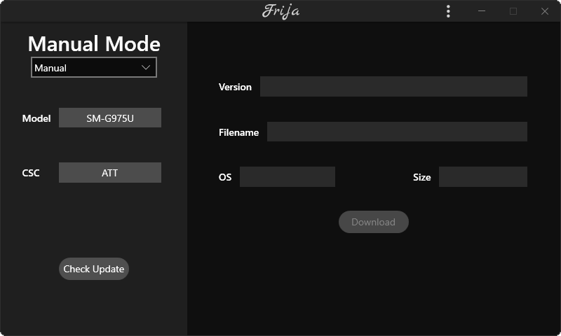
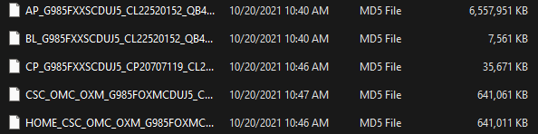

## Introduction

If you’re here, you’re probably looking to flash a firmware for your phone! No need to worry if you have no experience flashing firmware, it isn’t too complicated. With experience in this process, I will try my best to explain how to do this in the most simple way possible. If you’ve never done this before, I recommend reviewing this guide multiple times to get a better grasp of what to do and reduce your chances of user error. I am not responsible for any potential damage to your device (in the worst case, your device gets soft bricked, which is fixable via this process anyway!)

### Why flash a different firmware?

There are plenty of reasons why you should consider flashing a different firmware. Some reasons are, but not limited to:

* Issues with your current version (battery drain, overheating, etc.) that a factory reset may not always resolve.
  
* Getting rid of carrier bloatware and apps (This applies mostly to US models, which usually come preinstalled with carrier apps and bloatware that usually can’t be completely disabled or uninstalled. However, I can’t speak for regions with Exynos and other Snapdragon models regarding bloatware.
  
* Untimely software updates (Some regions and countries are more susceptible to this, as security patches may be late or delayed by weeks or even months. Have you seen others with the same phone as you getting updates before you? This is the reason why. There is a lot of variability in how updates are rolled out and Samsung’s update schedule isn’t always consistent.)

* A different region received a major update quicker.

### What are my options?

If you are in the United States, flashing the US unlocked firmware is your best bet. Free of any carrier bloatware and branding, this one brings the most “stock” Samsung experience for your device and is virtually compatible with any carrier. An exception I have seen is where AT&T may not fully support features such as VoLTE and WiFi calling on unlocked firmware or phones for whatever reason. To further emphasize AT&T’s questionable business practices, they also do not release their firmware which makes getting their branded firmware and devices the only way to get full access to their features. A potential (but not super concerning) con to US unlocked firmware is that software updates may be a little late compared to the carrier counterparts, but usually only by a few days or a week at worst. As of writing this report, unlocked models have beaten most carriers to the One UI 3.0 (Android 11) update. However, you don’t have to flash unlocked firmware, but I highly recommend doing so as it brings the cleanest software. You can also flash another carrier’s firmware. For example, if you have a T-Mobile phone but your carrier is Verizon, you may want Verizon firmware instead to get a better experience on their network. So in short, your options are US unlocked firmware or your provider’s firmware.
  
If you are in another region (e.g., Europe, Africa, Latin America) it gets a little more complicated. These regions and countries typically have Samsung’s own Exynos chip, which gives you a lot more flexibility in choosing a firmware. I will narrow it down later in explaining CSCs.

## Getting Started

There are a few things you will need in order to flash firmware. In short, you will need:

* A PC or laptop running Windows  
* A reliable USB Cable that handles transferring data (most)  
* A few programs  
  * [Frija](https://github.com/SlackingVeteran/frija-dev/releases/latest) (Windows app)
  * [Samfw](https://samfw.com/) (Website, note: use Direct Download or Download On Website only)
  * [Odin Patched 3.14.1](https://forum.xda-developers.com/t/patched-odin-3-13-1.3762572/)

### Using (and Understanding) Your Downloads

After downloading the corresponding programs, there will be a few simple concepts you will need to understand, starting with Frija.

::: info
Frija downloads the latest available firmware for your device, so if you wish to downgrade, you would need to use SamFW; Please remember to only use the Direct Download option as the Google Drive option is not recommended by me for specific reasons.
:::

- **Model**: This is the model number of your device. As shown in the image, I have the model number of a US unlocked Galaxy Note 9 (N960U1). Here, you will input the model number of the firmware you want to download (or the one you currently have). Model numbers can be found in your device’s settings in case you don’t know yours (for example, the US unlocked model number ends with a U1, compared to a U for carrier models).

- **CSC**: Here it gets a little more complicated. CSC refers to the country specific code which is a component of firmware binaries that contain customized settings, system configurations, and regional things such as APN settings. For the US they are pretty straightforward, but for other regions there are an abundance of CSCs.

CSCs in the US (a few examples): USC (US Cellular), VZW (Verizon), TMB (T-Mobile), XAA (unlocked). You will need the corresponding CSC when you download firmware (even if you flash a firmware with the incorrect one, your SIM card will adjust it accordingly).
CSCs elsewhere: A country may have its own CSC, alongside carrier CSCs as well. An example (Germany in this case): DBT (unlocked), DTM (T-Mobile), and VD2 (Vodafone). I chose Germany as an example, as updates there are typically released first before anywhere else. A more comprehensive CSC list can be found here

Once you have entered your corresponding model number and CSC, press “Check Update” to retrieve the latest firmware version available and download it. Once the download is complete (do not close Frija until it is done decrypting), unzip the folder and you should see 5 files in the unzipped folder, as shown below:

These files will then be used in the flashing process accordingly

### Flashing Process

Once you have the files, you’re ready to flash the firmware! Open up Odin and you will be greeted with this page.

Then, you will need to put your phone in download mode. This may vary by model, but on the S20 (for example), you can enter download mode through powering off your phone, then by pressing and holding both volume buttons when it’s off. I recommend searching how to boot into download mode (e.g., Galaxy S10 download mode) if you have another device. Regardless, you should see this screen if you do it correctly (then press volume up to get to the second screen).

- Now plug in your phone. Odin will recognize that a device has been connected and should show up on the screen. As shown above in the Odin screenshot, there are 5 boxes where you will place the firmware files you downloaded previously (BL, AP, CP, and CSC; USERDATA will not be used). Click on each name and select the corresponding file (e.g., BL file goes into the BL slot, CP file into CP slot, and so on). Your computer may hang when doing the AP file (it’s a big file), but be patient and let it continue. Now, regarding CSC, you will have two options. The CSC file will wipe your device, while the HOME_CSC file will keep all your data intact. You can choose whatever is best for you, but I recommend wiping and flashing a clean install (**regardless, backup your data beforehand**). Now that all your files are placed, click the “Start” button to begin flashing.

- If the flashing is successful, you will get a “PASS!” at the end. If you get a FAIL, it could be for various reasons such as firmware incompatibility, missing USB drivers, and vice versa. I recommend looking at this for more detail.
- And that’s it! If all went well, you should be running the most up to date firmware on your device. Note that this guide outlined how to flash the latest version firmware available.

### Downgrading

Downgrading is also possible, given that the version you are trying to flash is on the same binary version as the current firmware on your device, there are multiple ways to find your binary version, some being:

::: warning Warning
Do not attempt to flash firmware on a lower binary version as the result is always unsuccessful, and it may softbrick your device.
:::

Keep in mind that since you won't be on your carrier's firmware, you will not have the carrier's unlock portal in the settings app, you'll have to find other means to unlock your device if it happens to be SIM locked to the carrier.